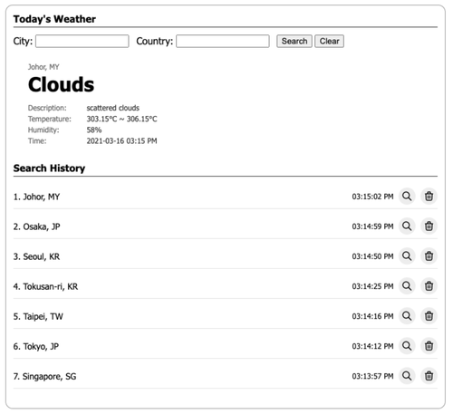
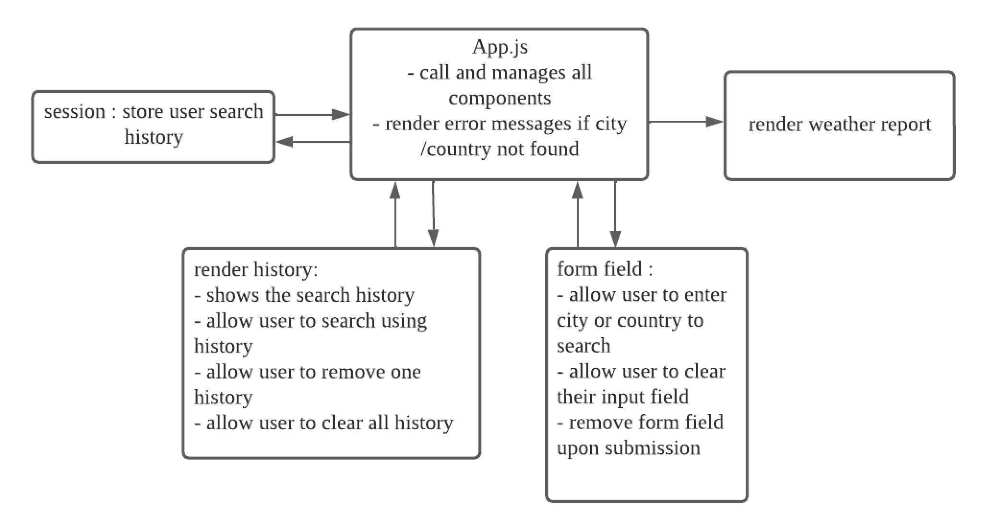

# **WEATHER TODAY**

## Task

To use React to complete the following tasks. If you are unsure about the question, feel free to make all the necessary UI behavior assumptions and state them in a separate document.

### Requirements

1. Display information at least based on mock up UI.
2. User can input city and country name to get weather information and display them on UI. Please
   use AJAX to get weather information from OpenWeatherAPI(https://openweathermap.org/api).
3. User can find their records in search history, and can click search button to call api again. Can click
   delete button to remove the record.
4. If user inputs invalid city or country name, show appropriate message on UI.

## Assumptions

- Access to current page is based on assumption that user have logged in.\
  For new browsers, if no existing session,it will auto create a dummy profile to start the program.

#

## Deployed link

Deployed @ https://99ace-weathertoday.netlify.app \
Github Code @ https://github.com/99Ace/99Ace-aquariux-weatherToday/tree/main/weathertoday

#

## Flowchart

## Features

_form search_

- User can search based on city name or country name
- User can click button or hit enter key to search
- User can hide/show the search bar when browsing the history

_search history_

- User can view their search history
- User can use their search history to render a search
- User can delete one history or clear all history
- User can view the weather condition, humidity, temperature of the location they search for

## Testing

https://validator.w3.org/

| Tested on                 | Results |
| ------------------------- | :-----: |
| https://validator.w3.org/ | Passed  |
| Iphone Device             | Passed  |
| Ipad Device               | Passed  |
| Android Phones            | Passed  |
| Macbook                   | Passed  |
| Laptop                    | Passed  |

## **Technology & Packages**

- Node
- React Js
- HTML/CSS
- Bootstrap
- dotenv
- craco
- Sass

## **Credits**

- Stackoverflow : https://stackoverflow.com/ - reference from stackoverflow
- Netlify : https://app.netlify.com/ - hosting the app
- OpenWeather : https://openweathermap.org/ - API source

- Julius, Yong San - for referring me to this opportunity
